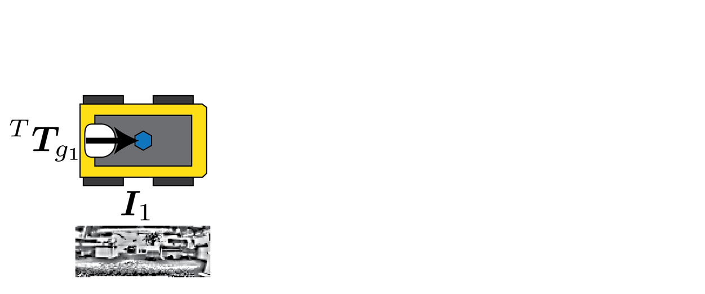
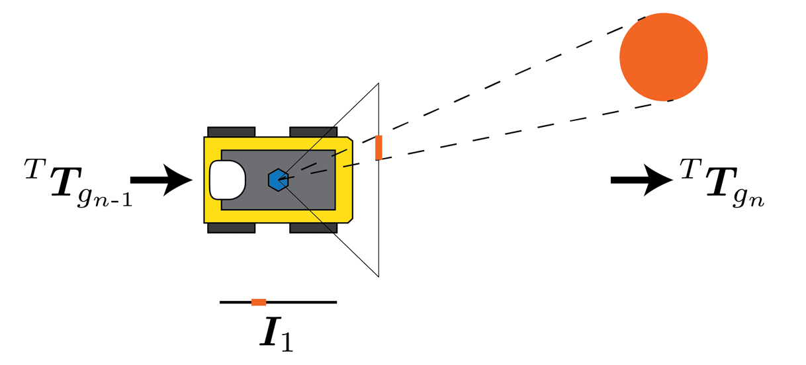
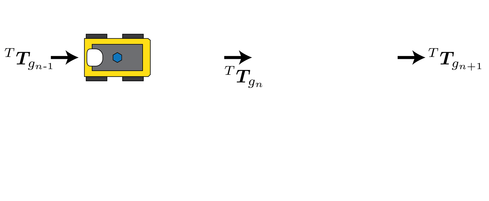
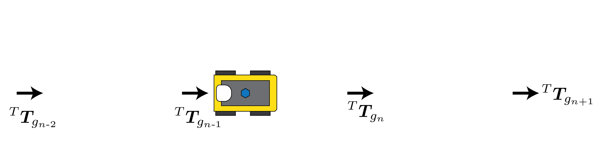

# Fast and Robust Bio-inspired Teach and Repeat Navigation

[](https://arxiv.org/abs/2010.11326)
[](https://doi.org/10.1109/IROS51168.2021.9636334)
[](./LICENSE)
[](https://github.com/Tobias-Fischer/ensemble-event-vpr/stargazers)
[](https://github.com/QVPR/teach-repeat/issues)
[](./README.md)
[](https://qcr.github.io)

This repository contains code for a low compute teach and repeat navigation approach which only requires monocular vision and wheel odometry. Teach the robot a route by teleoperation, then the robot will be able to repeat it - robust to lighting variation and moderate environmental changes. For full details see our [IROS2021 paper](https://doi.org/10.1109/IROS51168.2021.9636334), available on [arXiv](https://arxiv.org/abs/2010.11326). You can view the conference presentation [here](https://qvpr.github.io/teach-repeat/) as well as other multimedia material and a full 550 metre outdoor run.


## License and attribution

If you use the code in this repository, please cite [our paper](https://doi.org/10.1109/IROS51168.2021.9636334). The code is available under the [BSD-2-Clause License](./LICENSE).

```bibtex
@inproceedings{dallostoFastRobustBioinspired2021,
      title = {Fast and {{Robust Bio-inspired Teach}} and {{Repeat Navigation}}},
      booktitle = {2021 {{IEEE}}/{{RSJ International Conference}} on {{Intelligent Robots}} and {{Systems}} ({{IROS}})},
      author = {Dall'Osto, Dominic and Fischer, Tobias and Milford, Michael},
      year = {2021},
      month = sep,
      pages = {500--507},
      publisher = {{IEEE}},
      address = {{Prague, Czech Republic}},
      doi = {10.1109/IROS51168.2021.9636334},
}
```

## Setup and use

This approach can be used with any mobile robot with a monocular camera and odometry source.

For the teach run, run both the `data_collect.py` and `data_save.py` nodes. Teleoperate the robot along the desired route and the teach run (odometry poses and images) will be recorded to a specified folder.

For the repeat run, use `image_matcher.py` and `localiser.py`. The localiser will publish `Goal` messages on the topic `goal`, containing a goal to navigate to in the robot's odometry frame. An example `drive_to_pose_controller` is used here, but can be replaced with another controller as required.

In both cases, remap the `odom` and `image` topics to those provided by the robot. Note, the published odometry must also contain an integrated pose estimate.

Essential parameters for these nodes are shown below. Other parameters exist to save additional diagnostic data, or to wait for a ready signal before starting - if the robot needs to run a setup procedure for example. These are shown in the nodes and example usage is shown in the provided launch files.

### Global parameters

| Parameter                      | Description                                                                                                        | Default Value                       |
| ------------------------------ | ------------------------------------------------------------------------------------------------------------------ | ----------------------------------- |
| /data_load_dir                 | directory in which the teach runs are saved                                                                        | ~/miro/data                         |
| /data_save_dir                 | directory in which to save the results of a repeat run                                                             | ~/miro/data/follow-straight_tests/5 |
| /image_resize_width            | width to resize images before comparison                                                                           | 115                                 |
| /image_resize_height           | height to resize images before comparison                                                                          | 44                                  |
| /patch_size                    | patch size to use for patch normalisation                                                                          | (9,9)                               |
| /goal_pose_separation          | distance between goals, should match `~distance_threshold` in `data_collect.py`                                    | 0.2                                 |
| /image_field_of_view_width_deg | horizontal field of view of images (degrees)                                                                       | 175.2                               |
| /wait_for_ready                | whether the localiser waits for a service signal 'ready_localiser' before starting, allowing robot initialisation  | false                               |

### Parameters for `data_collect.py`

| Parameter            | Description                                                                                                   | Example Value |
| -------------------- | ------------------------------------------------------------------------------------------------------------- | ------------- |
| ~distance_threshold  | distance (metres) travelled from the previous pose after which a new pose is stored in the teach map          | 0.2           |
| ~angle_threshold_deg | angular distance (degrees) travelled from the previous pose after which a new pose is stored in the teach map | 15.0          |

### Parameters for `data_save.py`

| Parameter         | Description                                                                                                  | Example Value |
| ----------------- | ------------------------------------------------------------------------------------------------------------ | ------------- |
| ~save_dir         | directory in which to save the teach run                                                                     | ~/miro/data   |
| ~timestamp_folder | whether to timestamp the folder name of the teach run, so multiple runs can be performed without overwriting | true          |

### Parameters for `localiser.py`

| Parameter                 | Description                                                                                                                               | Default Value |
| ------------------------- | ----------------------------------------------------------------------------------------------------------------------------------------- | ------------- |
| ~rotation_correction_gain | proportional gain term to use for rotation corrections, $K_\theta$, shouldn't need to be tuned                                            | 0.01          |
| ~path_correction_gain     | proportional gain term to use for along-path corrections, $K_p$, shouldn't need to be tuned                                               | 0.01          |
| ~stop_at_end              | whether the robot should stop at the end of the route, otherwise it assumes the route is circular and restarts from the beginning         | true          |
| ~discrete-correction      | reduce compute by only performing a correction at each goal pose, not continually                                                         | false         |
| ~search-range             | how many teach images to search either side of the current to perform along-path correction                                               | 1             |
| ~global_localisation_init | when initialising, find the closest matching teach image to the current and start the route from there, otherwise start at the first goal | false         |
| ~min_init_correlation     | minimum correlation with a teach image at initialisation, otherwise the robot thinks it's not on the path and doesn't start repeating     | 0.0           |

## Overview of approach

### Teach run

First the robot needs to be taught a route via teleoperation. At regular distance intervals along the path the dead-reckoning position and and image will be saved, resulting in a topometric map of the route. Images are patch normalised to increase robustness to lighting variation.



### Repeat run

Having learnt a route, the robot can robustly repeat it. The robot initially follows the sequence of odometry poses stored during the teach run, but errors accumulate in this approach over time. Images are compared between the teach and repeat routes to make corrections to the route.

#### Correction overview

Both rotational and lateral path errors result in horizontal image offsets that can't be distinguished, but this is not a problem because both require the same correction response. However, moving along the path can also horizontal image offsets. These must be accounted for by interpolating between the previous and next goal images.



#### Orientation correction

If an orientation error is detected by comparing teach and repeat images, an associated path correction is performed, modulated by a constant gain factor. This correction causes the robot to steer back onto the path.



#### Along-path correction

Repeat images are compared to teach images within a certain search range of the current goal. If correlation values are stronger to images ahead or behind the robot's current estimated position, and along-path correction is performed. In this case, the goal is pulled towards the robot so it will be reached faster, allowing the estimated position to "catch up" to the real position.



## Examples of running teach and repeat for the robots we used

### Running teach on Miro

- `roslaunch teach_repeat data_collection_miro.launch`

### Running repeat on Miro

- `roslaunch teach_repeat data_matching_miro.launch`

### Running teach on Jackal

- `rosnode kill twist_mux` (optional, only required for comparison with bearnav)
- `roslaunch slam_toolbox localization.launch` (optional, only required for quantitative analysis)
- `roslaunch stroll_bearnav mapping-core-jackal.launch` (optional, only required for comparison with bearnav)
- `roslaunch stroll_bearnav mapping-gui-jackal.launch`  (optional, only required for comparison with bearnav)
- `roslaunch teach_repeat data_collection_jackal.launch`

### Running repeat on Jackal

- `roslaunch slam_toolbox localization.launch` (optional, only required for quantitative analysis)
- `roslaunch teach_repeat data_matching_jackal.launch`

### Running Bearnav repeat on Jackal

- `roslaunch slam_toolbox localization.launch`
- `roslaunch stroll_bearnav navigation-core-jackal.launch`
- `roslaunch stroll_bearnav navigation-gui-jackal.launch`
